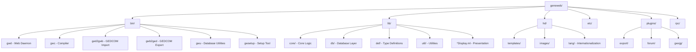
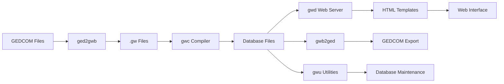
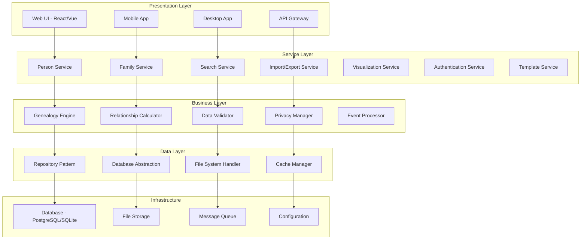
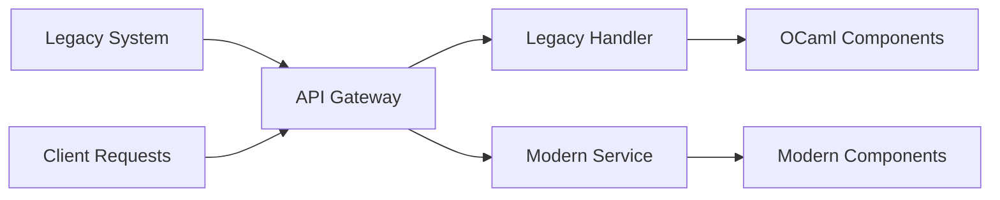

# Geneweb Legacy Code Modernization Analysis

## Executive Summary

This document provides a comprehensive analysis of the Geneweb OCaml codebase and outlines a detailed strategy for converting it to modern software architecture while preserving ALL existing features. Geneweb is a mature genealogy software written in OCaml with a web interface, supporting offline and web service modes.

## Table of Contents

1. [Current Architecture Analysis](#current-architecture-analysis)
2. [Feature Inventory](#feature-inventory)
3. [Proposed Modern Architecture](#proposed-modern-architecture)
4. [Migration Strategy](#migration-strategy)
5. [Structural Changes Required](#structural-changes-required)
<!-- 6. [Implementation Roadmap](#implementation-roadmap) -->

---

## 1. Current Architecture Analysis

### 1.1 Code Structure Overview



### 1.2 Main Modules and Dependencies

#### Core Components

- **Database Layer (`lib/db/`)**: File-based database with custom format

  - `database.ml/mli`: Main database interface
  - `dbdisk.ml/mli`: Disk-based storage
  - `driver.ml/mli`: Database driver abstraction
  - `collection.ml/mli`: Collections and indexing

- **Type Definitions (`lib/def/`)**: Core data structures

  - `def.ml`: Main genealogy types (person, family, events)
  - `adef.ml`: Auxiliary definitions

- **Core Logic (`lib/core/`)**: Genealogy algorithms
  - `consang.ml/mli`: Consanguinity calculations
  - `consangAll.ml/mli`: Global consanguinity computation

#### Presentation Layer

- **Display Modules**: Numerous `*Display.ml` files for HTML generation
- **Template Engine (`lib/templ/`)**: Template processing system
- **Web Server (`lib/wserver/`)**: HTTP server implementation

#### External Interfaces

- **GEDCOM Support**: Import/export functionality
- **Web Interface**: HTTP-based user interface
- **API Layer (`rpc/`)**: JSON-RPC support

### 1.3 Data Flow and Dependencies



### 1.4 External Dependencies

Based on `dune-project` analysis:

- **Core OCaml**: >= 4.08
- **Web**: markup, jingoo (templating), httpun
- **Compression**: camlzip
- **Unicode**: uutf, uunf, uucp, unidecode
- **Dates**: calendars
- **JSON**: yojson
- **Crypto**: digestif
- **Testing**: alcotest, ounit, qcheck

---

## 2. Feature Inventory

### 2.1 Core Genealogy Features

#### Person Management

- **Personal Information**: Names, dates, places, occupations
- **Life Events**: Birth, baptism, death, burial, cremation
- **Custom Events**: 50+ predefined event types + custom events
- **Relationships**: Parent-child, marriages, adoptions
- **Multimedia**: Image attachments and carousels
- **Privacy Controls**: Public, semi-public, private access levels

#### Family Management

- **Marriage Information**: Dates, places, witnesses
- **Relationship Types**: Married, not married, engaged, PACS, etc.
- **Divorce/Separation**: Status tracking with dates
- **Family Events**: Marriage, divorce, separation events
- **Witnesses**: Event witness management

#### Advanced Genealogy Features

- **Consanguinity Calculation**: Relationship coefficients
- **Sosa Numbering**: Ancestor numbering system
- **Relationship Computation**: Complex family relationship algorithms
- **Implex Detection**: Ancestor duplication identification
- **Nobility Titles**: Title management with dates and places

### 2.2 Data Management Features

#### Import/Export

- **GEDCOM Support**: Full import/export capability
- **Native Format**: .gw text format for data exchange
- **Database Compilation**: gwc compiler for database optimization
- **Backup/Restore**: Database utilities for maintenance

#### Search and Navigation

- **Name Search**: First name, surname, nickname searches
- **Advanced Search**: Multi-criteria searches
- **Browsing**: Alphabetical listing, calendar views
- **Place Management**: Geographic location handling

### 2.3 Visualization Features

#### Tree Displays

- **Ancestor Trees**: Vertical and horizontal layouts
- **Descendant Trees**: Multi-generation descendant views
- **DAG Visualization**: Complex relationship graphs
- **Fan Charts**: Circular ancestor displays
- **Timeline Views**: Chronological event displays

#### Relationship Views

- **Relationship Paths**: Visual relationship tracing
- **Cousin Calculations**: Extended cousin relationship tables
- **Common Ancestors**: Shared ancestry identification

### 2.4 Web Interface Features

#### Multi-language Support

- **40+ Languages**: Comprehensive internationalization
- **RTL Support**: Right-to-left language handling
- **Customizable Lexicon**: User-defined translations

#### Template System

- **Customizable Templates**: HTML template customization
- **Multiple Themes**: Template switching capability
- **Responsive Design**: Bootstrap-based modern UI
- **Asset Management**: Images, CSS, JavaScript handling

#### User Management

- **Authentication**: Multiple authentication schemes
- **Authorization**: Wizard, friend, public access levels
- **Session Management**: Login timeout and security

### 2.5 Administrative Features

#### Database Management

- **Setup Tools**: gwsetup for database creation/management
- **Consistency Checking**: Data validation and warnings
- **History Tracking**: Change logging and history
- **Merge Tools**: Person and family merging capabilities

#### Plugin System

- **Extensibility**: Plugin architecture for features
- **Forum Plugin**: Discussion forum functionality
- **Export Plugin**: Advanced export capabilities

---

## 3. Proposed Modern Architecture

### 3.1 Layered Architecture Overview



### 3.2 Layer Definitions

#### Data Layer

- **Repository Pattern**: Abstract data access with interfaces
- **Database Abstraction**: Support multiple database backends
- **File System Handler**: Manage images, templates, exports
- **Cache Manager**: In-memory caching for performance

#### Business Layer

- **Genealogy Engine**: Core genealogy logic and algorithms
- **Relationship Calculator**: Consanguinity and relationship computation
- **Data Validator**: Business rule validation and consistency checking
- **Privacy Manager**: Access control and data privacy
- **Event Processor**: Event sourcing for change tracking

#### Service Layer

- **Microservices Architecture**: Domain-specific services
- **API Contracts**: Well-defined service interfaces
- **Cross-cutting Concerns**: Logging, monitoring, security

#### Presentation Layer

- **Multi-platform Support**: Web, mobile, desktop clients
- **API Gateway**: Unified API access point
- **Authentication/Authorization**: Centralized security

### 3.3 API Design Principles

#### RESTful APIs

```
GET    /api/v1/persons/{id}
POST   /api/v1/persons
PUT    /api/v1/persons/{id}
DELETE /api/v1/persons/{id}

GET    /api/v1/families/{id}
POST   /api/v1/families
PUT    /api/v1/families/{id}
DELETE /api/v1/families/{id}

GET    /api/v1/relationships/{person1}/{person2}
GET    /api/v1/trees/ancestors/{id}
GET    /api/v1/trees/descendants/{id}
```

#### Event-Driven Architecture

```
PersonCreated
PersonUpdated
PersonDeleted
FamilyFormed
RelationshipEstablished
DataValidated
```

---

## 4. Migration Strategy

### 4.1 Strangler Fig Pattern Implementation



#### Phase 1: API Gateway Introduction

1. **Facade Layer**: Create API gateway in front of existing system
2. **Request Routing**: Route requests to legacy system initially
3. **Response Transformation**: Standardize response formats
4. **Monitoring**: Add observability to existing system

#### Phase 2: Service Extraction

1. **Data Access Layer**: Extract database operations
2. **Core Services**: Migrate individual services incrementally
3. **Feature Parity**: Ensure 100% feature compatibility
4. **A/B Testing**: Gradual traffic migration

#### Phase 3: Legacy Retirement

1. **Complete Migration**: Move all functionality to modern system
2. **Data Migration**: Migrate historical data
3. **Legacy Shutdown**: Decommission OCaml components

### 4.2 Interface Definitions

#### Core Domain Models

```typescript
interface Person {
  id: string;
  firstName: string;
  lastName: string;
  birthDate?: Date;
  deathDate?: Date;
  birthPlace?: string;
  deathPlace?: string;
  sex: Sex;
  privacy: PrivacyLevel;
  events: PersonEvent[];
  relationships: Relationship[];
  images: Image[];
}

interface Family {
  id: string;
  spouse1: PersonId;
  spouse2: PersonId;
  children: PersonId[];
  marriageDate?: Date;
  marriagePlace?: string;
  relationshipType: RelationshipType;
  divorce?: DivorceInfo;
  events: FamilyEvent[];
}

interface Relationship {
  type: RelationshipType;
  fromPerson: PersonId;
  toPerson: PersonId;
  startDate?: Date;
  endDate?: Date;
}
```

#### Service Interfaces

```typescript
interface PersonService {
  createPerson(person: CreatePersonRequest): Promise<Person>;
  updatePerson(id: string, updates: UpdatePersonRequest): Promise<Person>;
  deletePerson(id: string): Promise<void>;
  getPerson(id: string): Promise<Person>;
  searchPersons(criteria: SearchCriteria): Promise<PersonSearchResult>;
}

interface RelationshipService {
  calculateRelationship(
    person1Id: string,
    person2Id: string
  ): Promise<RelationshipResult>;
  findCommonAncestors(person1Id: string, person2Id: string): Promise<Person[]>;
  generateAncestorTree(
    personId: string,
    generations: number
  ): Promise<TreeNode>;
  generateDescendantTree(
    personId: string,
    generations: number
  ): Promise<TreeNode>;
}
```

### 4.3 Data Migration Strategy

#### Database Schema Evolution

```sql
-- Modern normalized schema
CREATE TABLE persons (
    id UUID PRIMARY KEY,
    first_name VARCHAR(255) NOT NULL,
    last_name VARCHAR(255) NOT NULL,
    birth_date DATE,
    death_date DATE,
    sex CHAR(1) CHECK (sex IN ('M', 'F', 'U')),
    privacy_level VARCHAR(20) DEFAULT 'PUBLIC',
    created_at TIMESTAMP DEFAULT NOW(),
    updated_at TIMESTAMP DEFAULT NOW()
);

CREATE TABLE person_events (
    id UUID PRIMARY KEY,
    person_id UUID REFERENCES persons(id),
    event_type VARCHAR(50) NOT NULL,
    event_date DATE,
    event_place TEXT,
    notes TEXT,
    sources TEXT
);

CREATE TABLE families (
    id UUID PRIMARY KEY,
    spouse1_id UUID REFERENCES persons(id),
    spouse2_id UUID REFERENCES persons(id),
    marriage_date DATE,
    marriage_place TEXT,
    relationship_type VARCHAR(50),
    created_at TIMESTAMP DEFAULT NOW()
);
```

#### Migration Scripts

1. **Data Export**: Extract data from legacy .gwb format
2. **Schema Mapping**: Map legacy fields to modern schema
3. **Data Validation**: Ensure data integrity during migration
4. **Incremental Sync**: Support ongoing data synchronization

---

## 5. Structural Changes Required

### 5.1 SOLID Principles Application

#### Single Responsibility Principle

- **Current**: Large monolithic display modules combining logic and presentation
- **Modern**: Separate concerns into distinct classes/modules

```typescript
// Instead of PersonDisplay.ml handling everything
class PersonRenderer {
  render(person: Person, template: Template): string;
}

class PersonValidator {
  validate(person: Person): ValidationResult;
}

class PersonRepository {
  save(person: Person): Promise<void>;
  findById(id: string): Promise<Person>;
}
```

#### Open/Closed Principle

- **Plugin Architecture**: Extensible without modifying core code
- **Strategy Pattern**: Configurable algorithms for relationship calculation

```typescript
interface RelationshipCalculator {
  calculate(person1: Person, person2: Person): RelationshipResult;
}

class StandardRelationshipCalculator implements RelationshipCalculator {
  calculate(person1: Person, person2: Person): RelationshipResult {
    // Implementation
  }
}

class ExtendedRelationshipCalculator implements RelationshipCalculator {
  calculate(person1: Person, person2: Person): RelationshipResult {
    // Enhanced implementation
  }
}
```

#### Liskov Substitution Principle

- **Database Abstraction**: Multiple database implementations

```typescript
interface DatabaseProvider {
  save(entity: Entity): Promise<void>;
  findById(id: string): Promise<Entity>;
}

class PostgreSQLProvider implements DatabaseProvider {
  // PostgreSQL implementation
}

class SQLiteProvider implements DatabaseProvider {
  // SQLite implementation
}
```

#### Interface Segregation Principle

- **Focused Interfaces**: Specific interfaces for different capabilities

```typescript
interface Readable<T> {
  findById(id: string): Promise<T>;
  findAll(): Promise<T[]>;
}

interface Writable<T> {
  save(entity: T): Promise<void>;
  delete(id: string): Promise<void>;
}

interface Searchable<T> {
  search(criteria: SearchCriteria): Promise<T[]>;
}
```

#### Dependency Inversion Principle

- **Dependency Injection**: Inject dependencies rather than creating them

```typescript
class PersonService {
  constructor(
    private personRepository: PersonRepository,
    private validator: PersonValidator,
    private eventBus: EventBus
  ) {}
}
```

### 5.2 Configuration Management Modernization

#### Current State

- Configuration mixed with code
- .gwf files for database-specific settings
- Hardcoded paths and values

#### Modern Approach

```typescript
interface Configuration {
  database: DatabaseConfig;
  security: SecurityConfig;
  features: FeatureFlags;
  ui: UIConfig;
}

interface DatabaseConfig {
  type: "postgresql" | "sqlite" | "mysql";
  host: string;
  port: number;
  database: string;
  credentials: DatabaseCredentials;
}

interface FeatureFlags {
  enableForum: boolean;
  enableAdvancedSearch: boolean;
  enableExport: boolean;
}
```

### 5.3 Error Handling Standardization

#### Result Type Pattern

```typescript
type Result<T, E = Error> =
  | {
      success: true;
      data: T;
    }
  | {
      success: false;
      error: E;
    };

class PersonService {
  async createPerson(
    request: CreatePersonRequest
  ): Promise<Result<Person, ValidationError>> {
    const validation = this.validator.validate(request);
    if (!validation.isValid) {
      return { success: false, error: new ValidationError(validation.errors) };
    }

    try {
      const person = await this.repository.save(request);
      return { success: true, data: person };
    } catch (error) {
      return { success: false, error: error as Error };
    }
  }
}
```

### 5.4 Logging and Monitoring Integration

#### Structured Logging

```typescript
interface Logger {
  debug(message: string, context?: object): void;
  info(message: string, context?: object): void;
  warn(message: string, context?: object): void;
  error(message: string, error?: Error, context?: object): void;
}

class PersonService {
  constructor(private logger: Logger) {}

  async createPerson(request: CreatePersonRequest): Promise<Person> {
    this.logger.info("Creating person", {
      firstName: request.firstName,
      lastName: request.lastName,
    });

    try {
      const person = await this.repository.save(request);
      this.logger.info("Person created successfully", { personId: person.id });
      return person;
    } catch (error) {
      this.logger.error("Failed to create person", error, { request });
      throw error;
    }
  }
}
```

### 5.5 Security Considerations

#### Authentication & Authorization

```typescript
interface AuthenticationService {
  authenticate(credentials: Credentials): Promise<AuthResult>;
  validateToken(token: string): Promise<User>;
}

interface AuthorizationService {
  canRead(user: User, resource: Resource): boolean;
  canWrite(user: User, resource: Resource): boolean;
  canDelete(user: User, resource: Resource): boolean;
}

// Privacy-aware data access
class PersonService {
  async getPerson(id: string, requestingUser: User): Promise<Person> {
    const person = await this.repository.findById(id);
    return this.privacyFilter.filter(person, requestingUser);
  }
}
```

---

<!-- ## 6. Implementation Roadmap

### 6.1 Phase 1: Foundation (Months 1-3)

#### Infrastructure Setup

- [ ] **Development Environment**: Set up modern development toolchain
- [ ] **CI/CD Pipeline**: Automated testing and deployment
- [ ] **Documentation**: API documentation and architecture guides
- [ ] **Monitoring**: Logging, metrics, and alerting infrastructure

#### API Gateway Implementation

- [ ] **Gateway Setup**: Deploy API gateway in front of legacy system
- [ ] **Legacy Proxy**: Route all requests to existing OCaml system
- [ ] **Response Standardization**: Normalize API responses
- [ ] **Authentication Proxy**: Centralize authentication handling

#### Data Layer Foundation

- [ ] **Database Design**: Design modern normalized schema
- [ ] **Migration Tools**: Build data migration utilities
- [ ] **Repository Pattern**: Implement abstract data access layer
- [ ] **Testing Data**: Create comprehensive test datasets

### 6.2 Phase 2: Core Services (Months 4-8)

#### Person Service Migration

- [ ] **Person Repository**: Implement modern person data access
- [ ] **Person Service**: Business logic migration
- [ ] **API Endpoints**: REST API for person operations
- [ ] **Feature Parity**: Ensure all person features work
- [ ] **Performance Testing**: Validate performance requirements

#### Family Service Migration

- [ ] **Family Repository**: Implement family data access
- [ ] **Relationship Logic**: Migrate relationship calculations
- [ ] **Marriage/Divorce Logic**: Complex relationship state management
- [ ] **API Endpoints**: REST API for family operations

#### Search Service Migration

- [ ] **Search Engine**: Implement modern search capabilities
- [ ] **Indexing**: Full-text search and indexing
- [ ] **Advanced Search**: Multi-criteria search functionality
- [ ] **Performance Optimization**: Search result caching

### 6.3 Phase 3: Advanced Features (Months 9-12)

#### Genealogy Engine

- [ ] **Consanguinity Calculation**: Complex relationship algorithms
- [ ] **Tree Generation**: Ancestor and descendant tree algorithms
- [ ] **Sosa Numbering**: Genealogical numbering systems
- [ ] **Relationship Paths**: Complex relationship path finding

#### Import/Export Services

- [ ] **GEDCOM Parser**: Modern GEDCOM import/export
- [ ] **Data Validation**: Comprehensive data validation
- [ ] **Batch Processing**: Handle large dataset imports
- [ ] **Format Support**: Multiple export formats

#### Visualization Services

- [ ] **Tree Rendering**: Modern tree visualization
- [ ] **Chart Generation**: Various chart types and formats
- [ ] **Interactive Features**: Dynamic tree exploration
- [ ] **Export Capabilities**: Image and PDF generation

### 6.4 Phase 4: User Interface (Months 13-16)

#### Modern Web UI

- [ ] **Frontend Framework**: React/Vue.js implementation
- [ ] **Responsive Design**: Mobile-first design approach
- [ ] **Component Library**: Reusable UI components
- [ ] **State Management**: Modern state management patterns

#### Template Migration

- [ ] **Template Engine**: Modern template processing
- [ ] **Theme System**: Customizable themes and layouts
- [ ] **Internationalization**: Modern i18n framework
- [ ] **Asset Management**: Optimized asset delivery

#### Progressive Enhancement

- [ ] **Legacy Compatibility**: Maintain existing template compatibility
- [ ] **Gradual Migration**: Feature-by-feature UI migration
- [ ] **User Testing**: Extensive user acceptance testing
- [ ] **Performance Optimization**: Frontend performance tuning

### 6.5 Phase 5: Advanced Features & Polish (Months 17-20)

#### Plugin System

- [ ] **Plugin Architecture**: Modern extensibility framework
- [ ] **Plugin Migration**: Migrate existing plugins
- [ ] **Plugin Marketplace**: Plugin discovery and management
- [ ] **API Documentation**: Comprehensive plugin development guides

#### Performance & Scalability

- [ ] **Caching Strategy**: Multi-level caching implementation
- [ ] **Database Optimization**: Query optimization and indexing
- [ ] **Horizontal Scaling**: Load balancing and clustering
- [ ] **Performance Monitoring**: Comprehensive performance tracking

#### Security Hardening

- [ ] **Security Audit**: Comprehensive security review
- [ ] **Vulnerability Assessment**: Automated security scanning
- [ ] **Compliance**: GDPR and privacy regulation compliance
- [ ] **Security Documentation**: Security best practices guide

### 6.6 Phase 6: Migration & Deployment (Months 21-24)

#### Data Migration

- [ ] **Migration Scripts**: Production data migration tools
- [ ] **Data Validation**: Comprehensive migration validation
- [ ] **Rollback Procedures**: Safe migration rollback capabilities
- [ ] **Performance Testing**: Production-scale performance validation

#### Production Deployment

- [ ] **Deployment Strategy**: Blue-green deployment setup
- [ ] **Monitoring**: Production monitoring and alerting
- [ ] **Backup & Recovery**: Disaster recovery procedures
- [ ] **Documentation**: Operations and maintenance guides

#### Legacy Retirement

- [ ] **Traffic Migration**: Gradual traffic shift to new system
- [ ] **Legacy Monitoring**: Monitor legacy system during transition
- [ ] **System Decommission**: Safe legacy system retirement
- [ ] **Post-Migration Support**: Extended support and monitoring

### 6.7 Risk Assessment and Mitigation

#### High-Risk Areas

1. **Data Migration Complexity**: Legacy data format complexity
   - **Mitigation**: Extensive testing, phased migration, rollback procedures
2. **Feature Parity**: Ensuring 100% feature compatibility
   - **Mitigation**: Feature-by-feature validation, user acceptance testing
3. **Performance Requirements**: Maintaining system performance
   - **Mitigation**: Performance benchmarking, optimization, monitoring

#### Medium-Risk Areas

1. **User Adoption**: User acceptance of new interface
   - **Mitigation**: Progressive enhancement, user training, feedback loops
2. **Integration Complexity**: Third-party integrations
   - **Mitigation**: API versioning, backward compatibility, thorough testing

#### Low-Risk Areas

1. **Technology Choice**: Modern technology stack adoption
   - **Mitigation**: Proven technologies, community support, documentation
2. **Development Team**: Team capability and knowledge transfer
   - **Mitigation**: Training, documentation, gradual responsibility transfer

### 6.8 Success Metrics

#### Technical Metrics

- **Performance**: Response time < 200ms for 95% of requests
- **Availability**: 99.9% system uptime
- **Scalability**: Support 10x current user load
- **Data Integrity**: 100% data migration accuracy

#### Business Metrics

- **Feature Parity**: 100% of existing features preserved
- **User Satisfaction**: 90%+ user satisfaction scores
- **Adoption Rate**: 95%+ user adoption of new interface
- **Support Requests**: 50% reduction in support requests

#### Quality Metrics

- **Code Coverage**: 90%+ test coverage
- **Security**: Zero critical security vulnerabilities
- **Documentation**: 100% API documentation coverage
- **Compliance**: Full GDPR compliance

--- -->

## Conclusion

This comprehensive modernization strategy provides a clear path for transforming the Geneweb OCaml codebase into a modern, scalable, and maintainable system while preserving all existing functionality. The Strangler Fig pattern ensures a safe, incremental migration with minimal risk to existing users and data.

The proposed layered architecture separates concerns effectively, enabling parallel development of UI and backend components. The implementation roadmap provides a realistic timeline with clear milestones and risk mitigation strategies.

Key success factors include:

- Maintaining 100% feature parity throughout the migration
- Implementing comprehensive testing at each phase
- Ensuring data integrity and security
- Providing clear API contracts for UI/Backend separation
- Following modern software engineering principles and practices

This modernization will position Geneweb as a contemporary genealogy platform capable of serving users effectively for the next decade and beyond.
